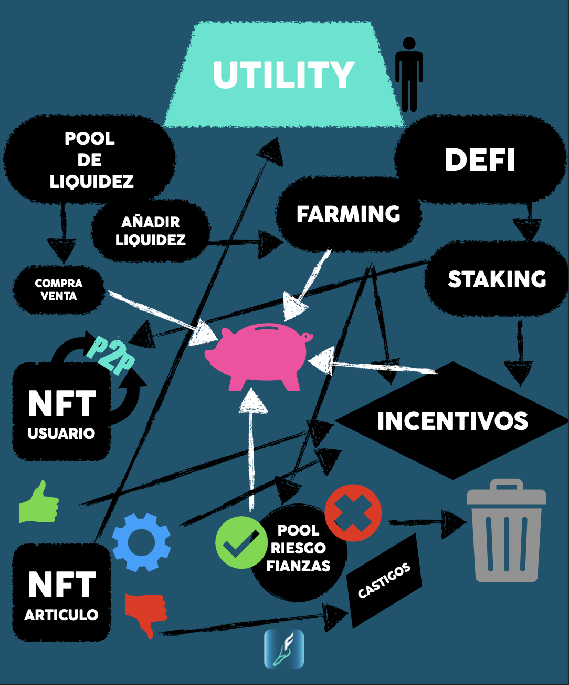

# FAC Litepaper

---

## 1. Síntesis
**FAC, la plataforma de viajes comprometida con grandes impactos.**

---

## 2. Introducción  
FAC es la primera plataforma turística colaborativa que convierte gear infrautilizado y conocimiento local en experiencias irrepetibles, accesibles y ecológicas. Tras dos pilotos exitosos (US $236 k facturados en 90 días) sin marketing masivo, lanzamos V1.0 en Q1 2026 con 9 000 proveedores y EBITDA positivo antes de fin de año.

---

## 3. Equipo y Superpoderes  
- **Fabio de Savorgnani (CEO):** Ingeniería Telemática & Máster en Logística, 20 años fundando TTE y G7 Gráfico, primer startup a los 14 años, facturó US $236 k en pilotos FAC.  
- **Josué González:** Cierra leads con velocidad récord.  
- **Héctor Salinas:** Diseña hardware y drones para ambientes extremos.  
- **Leonardo Villalobos:** Mantiene nubes con 99,99 % uptime.  
- **Johnny Miguel Carleo:** Multiplica visibilidad internacional.  
- **María Lucia Carrizo:** Dispara ROAS con análisis de shoppers.  
- **Gabriel Rodríguez:** Narrativa visual que engancha.  
- **Gabriel Moran:** Destila identidades de marca memorables.  
- **Mauricio Islas:** Amplifica mensajes a audiencias masivas.  
- **Carlos Domínguez:** Estructura fiscal que protege activos.

---

## 4. Identidad de Marca  
- **Colores:**  
  - Azul FAC `#1E3A8A`  
  - Verde ECO `#10B981`  
  - Naranja ACT `#F59E0B`  
  - Gris Neutro `#6B7280`  
- **Tipografías:**  
  - **Mikado Bold** (titulares)  
  - **Mikado Regular** (cuerpo)

---

## 5. Producto + Mercado  
- **Roles:**  
  - **Voyager:** Alquila gear & experiencias.  
  - **Agente:** Diseña tours QR.  
  - **Facilitador:** Renta artículos infrautilizados.  
  - **DT:** Recomienda y cobra 1 % vitalicio, transferible y heredable.  
- **TAM / SAM / SOM:**  
  - **TAM:** US $679 Bn/año  
  - **SAM:** US $272 Bn (40 % del TAM)  
  - **SOM:** US $ 8,1 M GMV (0,003 % del SAM en 3 años)  
- **Dolores clave:** sobrecargos de equipaje, oferta fragmentada, concentración de ganancias, huella de carbono elevada.  
- **Solución FAC:** renta in-destino, marketplace unificado, economía tokenizada e impacto ecológico medido.

---

## 6. Modelo de Negocio  
- **Fee total:** 18 %  
  - 8 % motores/pasarela  
  - 1 % DT → proveedor  
  - 1 % DT → Voyager  
  - 8 % split EC-FAC / FAC / holders  
- **Zero-inventory:** escala sin stock ni deuda.  
- **Tokenización:** $TRVL sustituye depósitos con pool descentralizado.  
- **Gobernanza:** DAO progresiva (centralizada → compartida → plena).  
- **IA integrada:** asistente curador de experiencias.

---

## 7. Economía del Token  
_(Sección intacta)_  

### 7.1. Token $TRVL: Utilidad con Propósito  
El token $TRVL es el combustible del ecosistema FAC. Su función principal es operar como depósito de garantía, medio de reputación y herramienta de redistribución de valor.

**Usos directos del token:**  
- Reserva de artículos sin necesidad de dinero fiat  
- Acceso a experiencias premium o exclusivas  
- Participación en recompensas y gobernanza futura (DAO)  
- Pago de comisiones a los Dealer Travelers (DT)  

---

### 7.2. Workflow On-Chain (Flujo de valor en la blockchain)  
Cada transacción en FAC queda registrada en la blockchain, permitiendo trazabilidad, reputación y seguridad para todas las partes.

**Incluye:**  
- GearNFT: Certificación de artículos  
- PersonaNFT: Reputación verificable  
- Pools descentralizados para garantías  

---

### 7.3. Modelo de Distribución de Tokens  

| Fase                   | Porcentaje | Destino                              |
|------------------------|------------|---------------------------------------|
| Comunidad inicial (DT) | 20 %       | Incentivos por referidos              |
| Proveedores fundadores | 15 %       | Agents y Facilitators pioneros        |
| DAO                    | 15 %       | Gobernanza y votaciones               |
| Tesorería FAC          | 25 %       | Recompras, expansión y contingencias  |
| Staking y Liquidez     | 15 %       | Exchanges y pools                     |
| Equipo y asesores      | 10 %       | Vesting lineal durante 36 meses       |

---

### 7.4. Política de Emisión y Suministro  
- Suministro total fijo: **100 millones de $TRVL**  
- Emisión controlada y limitada  
- Sin inflación programada, con recompensas temporales para adopción temprana  

---

### 7.5. Vesting y Liberación  
- **DT & Comunidad:** 25 % inmediato, 75 % lineal en 18 meses  
- **Equipo:** Cliff de 6 meses, vesting mensual durante 3 años  
- **Inversionistas:** 20–30 % al TGE, resto en 12 meses  

---

### 7.6. Pool de Garantía Descentralizado  
- Alimentado con stakes de proveedores y viajeros  
- Libera fondos tras validación on-chain  
- Penaliza siniestros con castigos automatizados  

---

### 7.7. Gobernanza y DAO  
Holders de $TRVL votan propuestas de mejora, nuevos roles, cambios en comisiones y asignación de tesorería.  

---

### 7.8. Futuro del Token  
- Expansión a nuevos verticales (artesanías, movilidad…)  
- Integración con DeFi: farming, staking, pools de liquidez  
- Utilidad real desde el MVP  

---

## 8. Roadmap  
- **Q4 2025:** MVP básico con reservas y QR  
- **Q1 2026:** Onboarding 9 000→14 000 usuarios  
- **Q2 2026:** Smart contracts + primer NFT  
- **Q3 2026:** Comunidad de agentes + IA  
- **Q4 2026:** Onboarding masivo & eventos  
- **2027:** DAO Beta, expansiones, app móvil, votaciones  
- **2028:** Concesiones, capitalización, alianzas, ecosistema autónomo  

---

## 9. Capitalización & Financiamiento  
- **Capital necesario:** US $ 1.3 M  
- **Gastos anuales:** US $ 984 k (nómina, legal, marketing, infra, viajes, IA…)  
- **Fases de fondeo:**  
  1. Bootstrapping & preventas  
  2. Venta de $TRVL (≃ 476 666 tokens a 3 USDT)  
  3. Alianzas estratégicas  

---

## 10. Futuribles  
- **Q3 2026:** Asistente IA  
- **Q4 2026:** GearNFT & PersonaNFT  
- **2027–28:** Estaciones FAC, matching “Confesiones”, carteleras dinámicas, concesiones DAO, RTsan, V2.0  

---
*Última revisión: julio 2025*  
